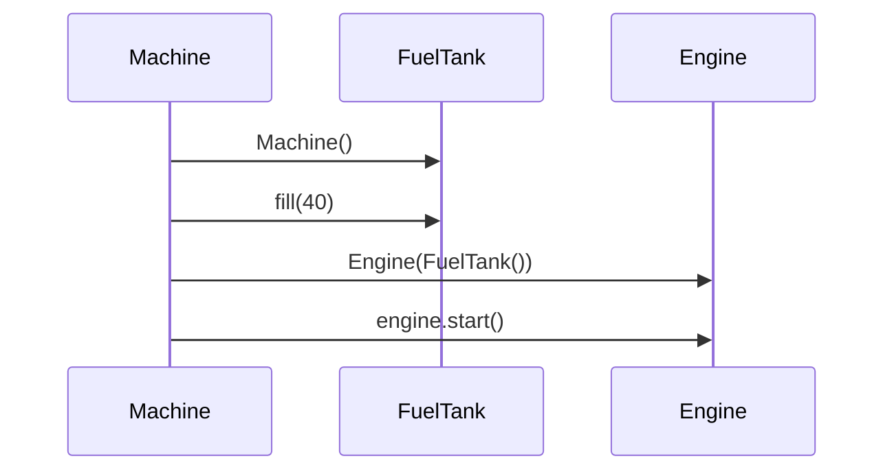

# Bensatankki sekvenssikaavio

```mermaid
sequenceDiagram
    Machine->>FuelTank: Machine()
    Machine->>FuelTank: fill(40)
    Machine->>Engine: Engine(FuelTank())
    Machine->>Engine: engine.start()
```
