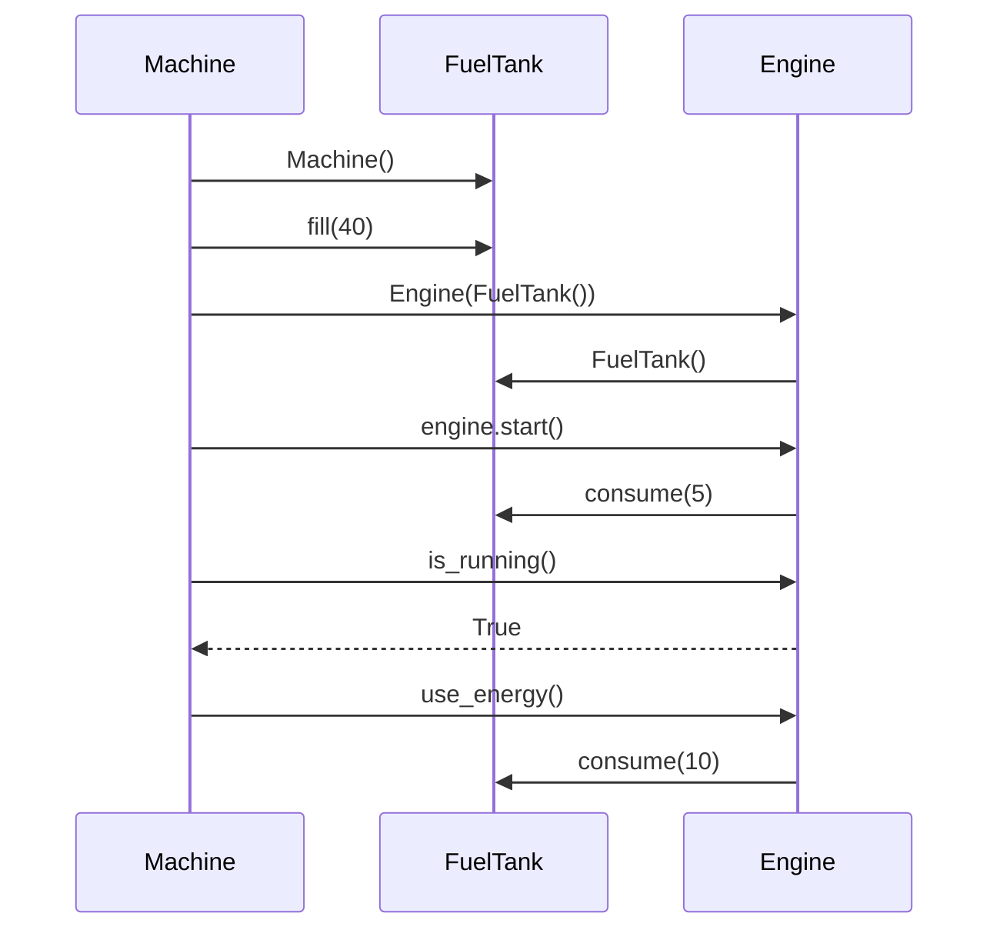

# Bensatankki sekvenssikaavio

```mermaid
sequenceDiagram
    Machine->>FuelTank: Machine()
    Machine->>FuelTank: fill(40)
    Machine->>Engine: Engine(FuelTank())
    Engine->>FuelTank: FuelTank()
    Machine->>Engine: engine.start()
    Engine->>FuelTank: consume(5)
    Machine->>Engine: is_running()
    Engine-->>Machine: True
    Machine->>Engine: use_energy()
    Engine->>FuelTank: consume(10)
```
