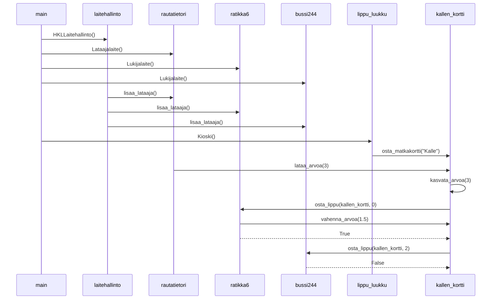

# Matkakortin sekvenssikaavio (tehtävä 4)

```mermaid
sequenceDiagram
    main->>laitehallinto: HKLLaitehallinto()
    main->>rautatietori: Lataajalaite()
    main->>ratikka6: Lukijalaite()
    main->>bussi244: Lukijalaite()
    laitehallinto->>rautatietori: lisaa_lataaja()
    laitehallinto->>ratikka6: lisaa_lataaja()
    laitehallinto->> bussi244: lisaa_lataaja()
    main->>lippu_luukku: Kioski()
    lippu_luukku->>kallen_kortti: osta_matkakortti("Kalle")
    rautatietori->>kallen_kortti: lataa_arvoa(3)
    kallen_kortti->>kallen_kortti: kasvata_arvoa(3)
    kallen_kortti->>ratikka6: osta_lippu(kallen_kortti, 0)
    ratikka6->>kallen_kortti: vahenna_arvoa(1.5)
    ratikka6-->>kallen_kortti: True
    kallen_kortti->>bussi244: osta_lippu(kallen_kortti, 2)
    bussi244-->>kallen_kortti: False
```
