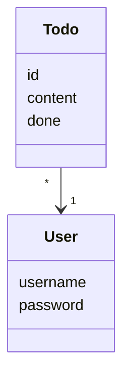

esimerkki:


# Monopoli luokkakaavio

```Mermaid
classDiagram
    Monopoli "1" -- "1" Pelilauta
    Pelilauta "1" <.. "2" Nopat
    Monopoli "1" -- "2..8" Pelaajat
    Pelaajat "2..8" -- "1" Pelinappula
    Pelilauta "1" -- "40" Ruudut
    Pelilauta "1" <.. "1" Pelinappula
    Ruudut "40" <|-- "1" Aloitusruutu
    Ruudut "40" <|-- "1" Vankila
    Ruudut "40" <|-- "*" Sattuma
    Ruudut "40" <|-- "*" Yhteismaa
    Ruudut "1" <|-- "*" Kadut
    Kadut "*" -- "0..4" Talot
    Kadut "*" -- "0..1" Hotellit
    Pelaajat "1" -- "1" Raha
    Kortti "*" -- "*" Yhteismaa
    Kortti "*" -- "*" Sattuma
    Kortti "1" -- "1" Toiminto
```
